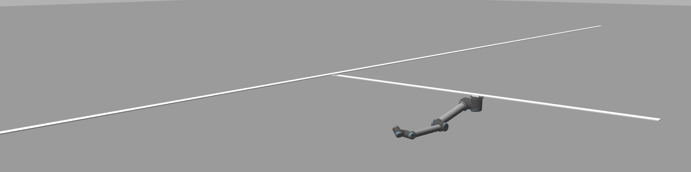

# Ceiling mounted robot

The repository contains rail ceiling 2-DOF robot with arm. The ur10 arm example is available.

# Install

Install dependencies

    sudo apt-get install ros-noetic-ur-description ros-noetic-rqt-joint-trajectory-controller

Download and build the repository

    mkdir -p ~/rosws/src && cd ~/rosws/src
    git clone https://github.com/kirillin/ceiling_arm_description.git
    cd ~/rosws && catkin build

# Run

Start the gazebo and spawn the robot

    source cd ~/rosws/devel/setup.bash
    roslaunch ceiling_arm_description start_demo_gazebo_with_arm.launch

Test to control using a GUI

    rosrun rqt_joint_trajectory_controller rqt_joint_trajectory_controller 

